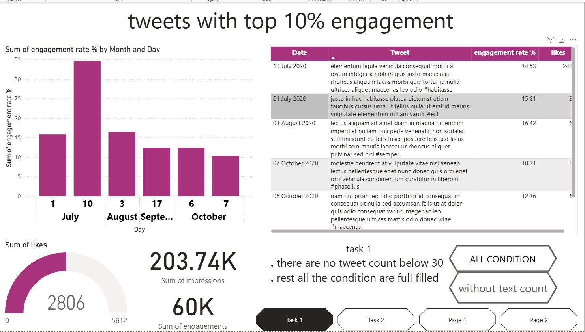

# 🐦 POWER BI Twitter Analysis Dashboard
> An interactive Power BI dashboard built during a Data Analytics internship — using Power Query and DAX to surface top-performing tweets under complex, time-and-condition-based business rules.

This project was completed as part of a Data Analyst internship, applying advanced Power Query transformations, DAX-driven dynamic visibility, and Power BI bookmarks to answer strict, multi-condition engagement questions on Twitter data.

---

## 🖼️ Dashboard Preview

📊 [View Power BI File](task1__6_.pbix)

---

## 📌 Business Scenario & Objective

Stakeholders needed to identify **which tweets truly drive engagement** — but only under specific, layered business conditions (time window, weekday-only, character/word count limits, even/odd date rules). A static chart couldn't handle that complexity.

**Goal:** Use Power Query to filter and transform raw tweet data against strict multi-condition rules, then build a dashboard where charts dynamically show/hide based on time-of-day logic and offer a fallback view when no data meets every condition.

---

## 📈 Key Dashboard Metrics

| Metric | Value | Insight |
| :--- | :--- | :--- |
| **Sum of Impressions** | 203.74K | Total reach across the filtered tweet set |
| **Sum of Engagements** | 60K | Combined likes, retweets, and replies |
| **Sum of Likes (gauge)** | 2,806 / 5,612 | ~50% of maximum tracked like-volume achieved |
| **Top Engagement Day** | 10 July (34.53%) | Single highest engagement-rate spike in the dataset |
| **Peak Month by Engagement** | July | Two of the top data points (1 & 10) fall in July |

> **Key Insight:** Engagement rate peaked sharply on **10 July at 34.53%**, more than double the next-highest day — a single-day anomaly worth flagging to stakeholders rather than averaging away.

---

## 🛠️ Task-by-Task Breakdown

| # | Task | Conditions Applied | Technique Used | Outcome |
| :--- | :--- | :--- | :--- | :--- |
| 1 | Top Tweets by Engagement Rate | >50 likes · weekdays only · 3–5 PM IST · <30 characters | Power Query filters + DAX time-based visibility | No tweets matched the strict <30-character rule → built a **"Show Rest"** button to reveal tweets meeting every other condition |
| 2 | Top Tweets by Retweets & Likes | Exclude weekends · even impressions · odd-numbered date · <30 words · 3–5 PM IST | Calculated ranking column + DAX visibility table (1/blank flag) | Same all-conditions-met gap → **"Show Rest"** button implemented again for stakeholder usability |
| 3 | Clustered Bar Chart for Interactions | Likes vs Retweets vs Replies by day | Power BI clustered bar visual | Enabled side-by-side interaction-type comparison |
| 4 | Line Chart of Engagement Trends | Engagement % by Month & Day | Time-series line/bar visual | Revealed the July 10 spike and steady drop-off through October |
| 5 | Engagement Rate Comparison for App-Open Tweets | Tweet-type segmentation | Comparative visual | Isolated how app-open-triggered tweets perform vs. others |

---

## ⚙️ Process & Methodology

**1. Data Cleaning & Transformation**
Cleaned and standardized the raw tweet dataset in Power Query — parsing dates/times, computing character and word counts, and flagging weekday/weekend and odd/even fields for rule-based filtering.

**2. Dynamic Time-Based Visibility (DAX)**
Built a helper table that flags whether the current time falls within a target IST window (e.g. 3–5 PM), returning `1` inside the window and blank outside it — then used that flag to control chart visibility, so dashboards only display relevant visuals during the specified hours.

**3. "Show Rest" Fallback Pattern**
Since several strict multi-condition rule sets returned zero matching tweets, a reusable **bookmark-toggled button** pattern was built: click reveals a secondary chart with every condition applied *except* the single blocking one (e.g. character/word count), keeping the dashboard useful even under edge-case data.

**4. Engagement Ranking**
Engagement was computed as a combination of likes, retweets, and replies, then ranked to surface the top 10% (or top 10) tweets per task.

---

## 🎓 Skills & Competencies Gained

- **Power Query transformations** on complex, multi-condition filtering logic
- **DAX-driven conditional visibility** for time-window-restricted visuals
- **Power BI bookmarks** for interactive button-based chart toggling
- **Dashboard UX design** for edge cases where strict filters return no data

---

## 🏁 Conclusion

This project demonstrated end-to-end Power BI capability under real-world constraints: strict, layered business rules frequently produced empty result sets, and the dashboard was engineered to stay useful anyway — through dynamic time-based visibility and a fallback "Show Rest" pattern, rather than presenting stakeholders with a blank chart.

---

## 📁 Repository Files

* 📊 `task1__6_.pbix`: Power BI file with full interactive dashboard and DAX logic
* 🖼️ `task1_top10_engagement.png`: Dashboard preview image
* 📝 `README.md`: Project overview, tasks, and key insights
